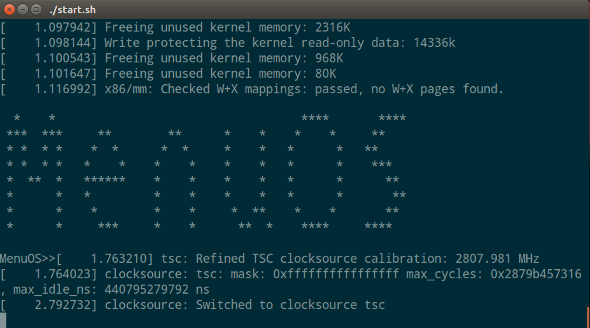
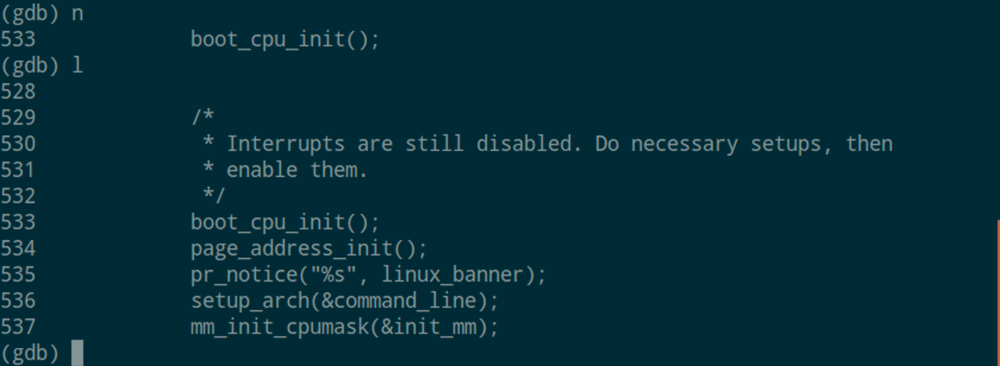
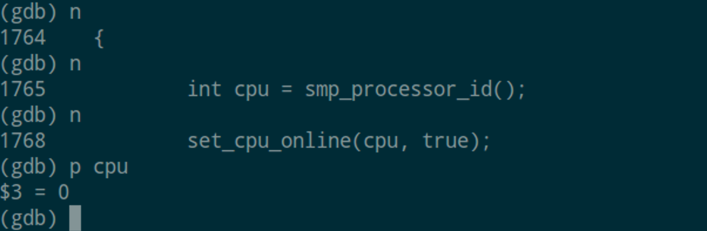
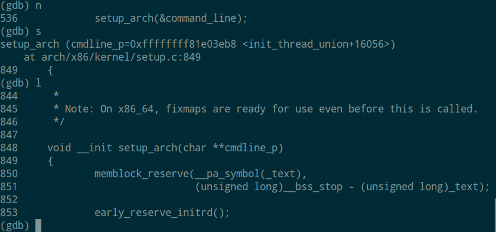
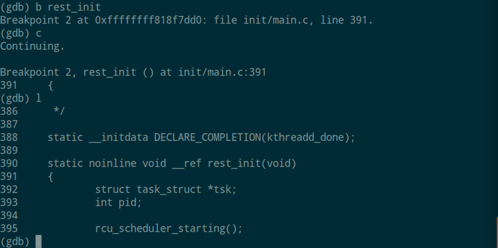
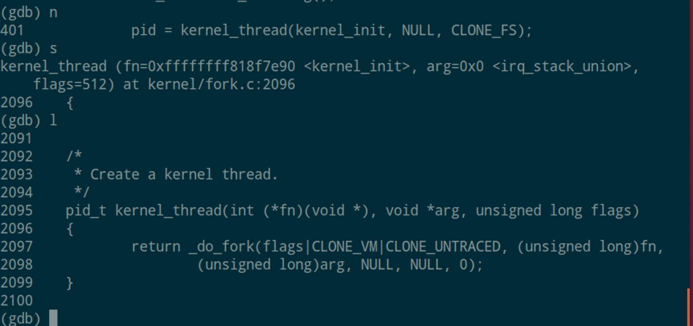
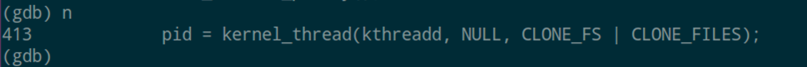
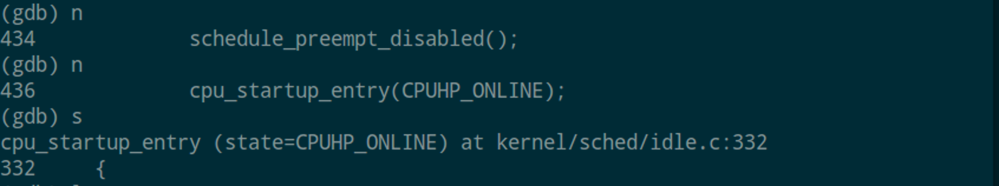

# Linux 内核启动调试分析

### 张立夫 PB15020718

## 一、下载编译内核 

### 1. 实验环境

- kernel：linux-4.13
- gdb：7.11.1
- qemu：2.5.0

### 2. 内核下载

从[官网](www.kernel.org)下载，为了方便，下载了和虚拟机所使用的相同版本的内核。

下载得到 `linux-4.13.tar.xz` ，对其解压：

```shell
xz -d linux-4.13.tar.xz
tar -xf linux-4.13.tar
```

### 3. 编译内核

为了方便起见，将虚拟机中的 config 文件拷贝作为 `make` 的 `.config` 文件（需要 `sudo` 权限），然后进行 `make` 其中用到参数 `-j4` ，可以让 `make` 利用分配给虚拟机的全部四个线程进行编译，可大大缩短时间：

```shell
sudo cp /boot/config-4.13.0-36-generic .
make -j4
```

### 4. 配置环境

1. 下载 `qemu` 

```shell
sudo apt-get install qemu
```

2. 更新本机自带 `gdb`

```shell
sudo apt-get update
```

3. 制作根文件系统 rootfs

   这里采用了网上的一个简洁的跟文件系统 MenuOS:

```shell
mkdir rootfs
git clone https://github.com/mengning/menu.git
cd menu
gcc -Wall -pthread -o init linktable.c menu.c test.c -m32 -static #编译
cd ../rootfs 
cp ../menu/init ./
find . | cpio -o -Hnewc |gzip -9 > ../rootfs.img #得到rootfs.img
```

### 5. 运行

- 启动 `qemu`

```shell
qemu-system-x86_64 -kernel ~/OSH/linux-4.13/arch/x86_64/boot/bzImage -initrd ~/OSH/linux-4.13/rootfs.img -append "console=ttyS0 nokaslr" -s -S -nographic
```

- 启动 `gdb`

```shell
gdb
(gdb)file vmlinux
(gdb)target remote:1234
(gdb)break start_kernel
```

为方便多次调试，创建`qemu` 启动脚本 `start.sh` 如下，通过 `tee` 命令，将内核启动日志打印到 `boot_log` 中：

```shell
#!/bin/bash
qemu-system-x86_64 -kernel ~/OSH/linux-4.13/arch/x86_64/boot/bzImage -initrd ~/OSH/linux-4.13/rootfs.img -append "console=ttyS0 nokaslr" -s -S -nographic | tee boot_log
```

在运行 `gdb` 调试时，当设置断点后按 `c` 继续就会出现以下报错，并且无法继续调试：

```
Remote 'g' packet reply is too long: ...
```

经过查阅资料，在[这里](https://wiki.osdev.org/QEMU_and_GDB_in_long_mode)有比较详细的说明与解决办法，由于我是使用系统自带的 `gdb` 工具，所以无法从源文件进行修改，又因为 `gdb` 在报错时会中断脚本，所以写了两段 `gdb` 脚本，以方便使用：

脚本1 `gdb1`

```shell
set arch i386:x86-64
file ~/OSH/linux-4.13/vmlinux
target remote:1234
b start_kernel
c
```

脚本2 `gdb2`

```shell
disconnect
set arch i386:x86-64:intel
target remote:1234
```

使用：

```shell
gdb
(gdb)source gdb1
(gdb)source gdb2
```

由此即可直接到达 `start_kernel` 断点处。

附内核启动成功图：



## 二、内核启动调试与进程追踪

### 1. start_kernel

从某种意义上，`start_kernel` 就像一般程序中的 `main` 函数，在进入该函数前，系统进行的都是一些较低层次的与硬件相关的汇编语言初始化，从这里开始内核程序的初始化，也就是从这里之后为c语言编写。`start_kernel` 存在于  `init/main.c` 中，其主要任务为完成内核的初始化与建立祖先进程（ 1 号进程）。

#### 1.1 init_task

`init_task` 为一个全局变量，这是内核中所有进程的雏形，其所代表的数据结构 `task_struct` 中保存了一个进程的所有基本信息，包括进程的状态，pid，栈的起始地址等等， `init_task` 完成初始化后最终演变成 0 号进程，这个将在之后的 `rest_init` 中追踪。

#### 1.2 boot_cpu_init

该函数目的为初始化每一个 CPU，`boot_cpu_init` 函数存放在`/kernel/cpu.c` 中



进入 `boot_cpu_init` 函数，其代码定义如下：

```c
void __init boot_cpu_init(void)
{
	int cpu = smp_processor_id();

	/* Mark the boot cpu "present", "online" etc for SMP and UP case */
	set_cpu_online(cpu, true);
	set_cpu_active(cpu, true);
	set_cpu_present(cpu, true);
	set_cpu_possible(cpu, true);

#ifdef CONFIG_SMP
	__boot_cpu_id = cpu;
#endif
}
```

其中 `cpu` 为当前处理器的 ID（如下图为 0 号 cpu ），之后的四个函数设置了当前 CPU 的在线，激活以及热插拔和对于某个 CPU 的调度分配。



#### 1.3 setup_arch

该函数定义在  `/arch/x86/kernel/setup.c` 



`setup_arch` 是系统架构的初始化，通过检测出来的处理器类型进行处理器内核的初始化，然后进行内存结构的初始化与物理内存的映射，因为其中涉及过程较为繁复，故没有更深一步追踪。

#### 1.4 其他一些初始化：

在 `start_kernel` 中还有一些较重要初始化函数：

`mm_init` ：内存相关初始化，包括内核缓存初始化 `kmem_cache_init` 

`sched_init` ：初始化系统调度进程

`tick_init` ：初始化内核时钟系统

`signals_init` ：创建信号队列高速缓冲

`proc_root_init` ：在内存中初始化包括根节点的所有节点信息

### 2. rest_init

在 `start_kernel` 的最后有一个很重要的函数 `rest_init` ，在该函数中完成了真正的第一个进程的创建，也就是祖先进程（1 号进程）以及 2 号进程的创建和 0 号进程的转变。首先进入到 `rest_init` 函数中：



#### 2.1 祖先进程的创建

根据源代码：

```c
static noinline void __ref rest_init(void)
{
	struct task_struct *tsk;
	int pid;

	rcu_scheduler_starting();
	/*
	 * We need to spawn init first so that it obtains pid 1, however
	 * the init task will end up wanting to create kthreads, which, if
	 * we schedule it before we create kthreadd, will OOPS.
	 */
	pid = kernel_thread(kernel_init, NULL, CLONE_FS);
    ...
}
```

我们从其中自带的注释就可以看出，1 号进程通过 `kernel_thread` 函数进行创建，`kernel_thread` 函数在 `kernel/fork.c` 中定义如下：



```c
pid_t kernel_thread(int (*fn)(void *), void *arg, unsigned long flags)
{
	return _do_fork(flags|CLONE_VM|CLONE_UNTRACED, (unsigned long)fn,
		(unsigned long)arg, NULL, NULL, 0);
}
```

这里调用了 `_do_fork` 分出了新的进程执行 `kernel_init` 函数，然后再将分出来的新进程的 pid 返回给 `rest_init` 中的 `pid` 。对于 `kernel_init` 函数，其定义在 `/init/main.c` 中，这个函数作为进程被启动，但是之后它将读取根文件系统下的 `init` 程序，这个操作实现了从内核态到用户态的转变，而这个 `init` 进程是所有用户态进程的父进程，它生了大量的子进程，这就是祖先进程的创建。

#### 2.2 2号进程的创建和 0 号进程的转化



通过 `kernel_thread` 创建第二个内核进程 `kthreadd` ，该进程的主要作用就是负责管理和调度其他内核进程。至此 `init_task` 的任务已全部完成。在 `rest_init` 的结尾，调用了函数 `cpu_startup_entry` ，该函数定义在 `kernel/sched/idle.c` 中：



```c
void cpu_startup_entry(enum cpuhp_state state)
{
#ifdef CONFIG_X86
	boot_init_stack_canary();
#endif
	arch_cpu_idle_prepare();
	cpuhp_online_idle(state);
	while (1)
		do_idle();
}
```

可以看到最后会有一个死循环，到这里，`init_task` 就彻底转变为了 idle 进程，也就是 0 号进程在不停的进行循环。

至此 `start_kernel` 函数执行完毕，内核基本初始化完成。

## 三、总结

本次实验中在搭建环境上花了很多时间，同样的在这个过程中自己也学到了很多关于内核启动的东西，对内核启动的整体步骤有了大概的印象，也掌握了利用 `qemu` 和 `gdb` 调试内核的一系列方法，中间遇到了不少坑，倒是基本上都解决了，总体而言，本次实验对自己的提升还是非常大的。

PS：本次实验中用到的脚本 `start.sh` , `gdb1` , `gdb2` 和日志 `boot_log` 均已提交至仓库。